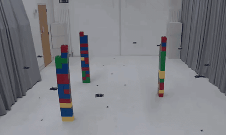
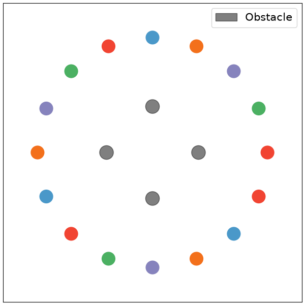
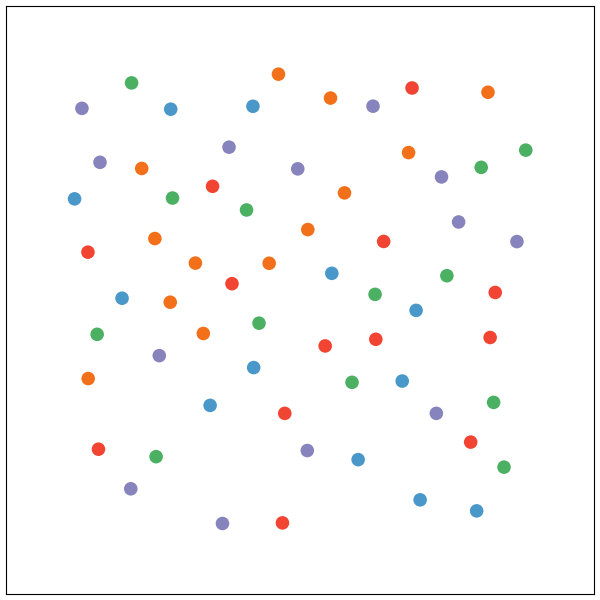

<div align="center">
  <h1>Denoising Multi-Robot Trajectories</h2>
  <b>IEEE Transactions on Robotics (T-RO) 2026</b>
  <p>
    <a href="https://yuhaozhang7.github.io" target="_blank">Yuhao Zhang</a><sup>1</sup>,
    <a href="https://kei18.github.io/" target="_blank">Keisuke Okumura</a><sup>1,2</sup>,
    <a href="https://www.cl.cam.ac.uk/~as3233/" target="_blank">Ajay Shankar</a><sup>1</sup>,
    <a href="https://www.cst.cam.ac.uk/people/asp45" target="_blank">Amanda Prorok</a><sup>1</sup><br>
    <sup>1</sup>Prorok Lab, University of Cambridge &nbsp;&nbsp;
    <sup>2</sup>AIST Japan
  </p>

  []()
  [](https://www.youtube.com/watch?v=WuFuecpZQSY)
</div>

<p align="center">
  
</p>


This repository includes code for **D4orm** and its variants. Built on [model-based diffusion](https://github.com/LeCAR-Lab/model-based-diffusion), D4orm refines control trajectories through parallel sampling and diffusion denoising to generate kinodynamically feasible, collision-free multi-robot motion. Its decoupled, online receding-horizon, and distributed variants extend this framework to large robot teams, feedback control, and settings with limited computing resources.

> **Release notice:** The current release includes an implementation of **D4orm-D**, the decoupled planner. Implementations of other **D4orm** variants will be released progressively.


## Environment setup

Use Python 3.10 or newer. From the repository root, create an environment and
install the package:

```bash
python -m venv .venv
source .venv/bin/activate
python -m pip install -e .
```

You can also install into an existing Conda environment. For GPU support, follow
the [JAX installation guide](https://docs.jax.dev/en/latest/installation.html)
for your hardware. Check the available devices with:

```bash
python -c "import jax; print(jax.devices())"
```

## Basic usage

Run a planner and save its trajectory as a GIF and PNG:

```bash
d4orm --method d4orm-d --env-name multi2dholo --num-agents 16 --save-images
```

Available methods are `d4orm`, `d4orm-d`, `mppi`, and `cem`.
The module entry point accepts the same options:

```bash
python -m d4orm.planners.multi_planner --method d4orm-d
```

| Environment | Description |
|---|---|
| `multi2d` | Differential-drive robots. |
| `multi2dholo` | 2D holonomic robots. |
| `multi2dheter` | Mixed holonomic and differential-drive robots. |
| `multi3dholo` | 3D holonomic robots. |
| `multi2dholo_obsX` | 2D holonomic robots with X obstacles, e.g. `multi2dholo_obs4`. |
| `multi2dholo_random` | 2D holonomic robots with random starts and grid goals. |

Results are saved under `results/<method>/<environment>/`, named by agent count
and seed. Use `--output-dir` to choose another location. Repeating the same
settings overwrites those files. Reported planning time excludes JAX warm-up.

## Main parameters

| Parameter | Default | Meaning |
|---|---|---|
| `--method` | `d4orm` | Planner to run. |
| `--env-name` | `multi2dholo` | Environment from the table above. |
| `--num-agents` | `16` | Number of robots. |
| `--num-samples` | `1024` | Candidate trajectories per optimization step. |
| `--horizon` | `100` | Number of control timesteps in each trajectory. |
| `--num-steps` | `100` | Denoising or sampling updates per optimization iteration. |
| `--dt` | `0.1` | Simulation timestep in seconds. |
| `--seed` | `0` | Random seed for the environment and planner. |
| `--direct-path-init` | off | Initialize using direct goal-directed controls for D4orm-D. |
| `--save-images` | off | Save GIF and PNG trajectories. |
| `--save-data` | off | Save trajectory arrays (NPZ) and run metadata (JSON). |
| `--print-info` | off | Print progress after each iteration. |
| `--output-dir` | `results` | Directory for saved output. |

Use `d4orm --help` for all options.

<table width="100%">
  <tr>
    <td align="center" width="50%">
      
      <br>2D Holonomic with 4 Obstacles
    </td>
    <td align="center" width="50%">
      
      <br>2D Holonomic with Random Positions
    </td>
  </tr>
</table>

## Citation
If you find this work to be useful in your research, please consider citing:
```bibtex
@article{zhang2026denoising,
  title={Denoising Multi-Robot Trajectories},
  author={Zhang, Yuhao and Okumura, Keisuke and Shankar, Ajay and Prorok, Amanda},
  year={2026}
}
```
```bibtex
@inproceedings{zhang2025d4orm,
  title={D4orm: Multi-Robot Trajectories with Dynamics-aware Diffusion Denoised Deformations},
  author={Zhang, Yuhao and Okumura, Keisuke and Woo, Heedo and Shankar, Ajay and Prorok, Amanda},
  booktitle={IEEE/RSJ International Conference on Intelligent Robots and Systems (IROS)},
  pages={14118--14123},
  year={2025},
  doi={10.1109/IROS60139.2025.11246029},
  publisher={IEEE}
}
```
